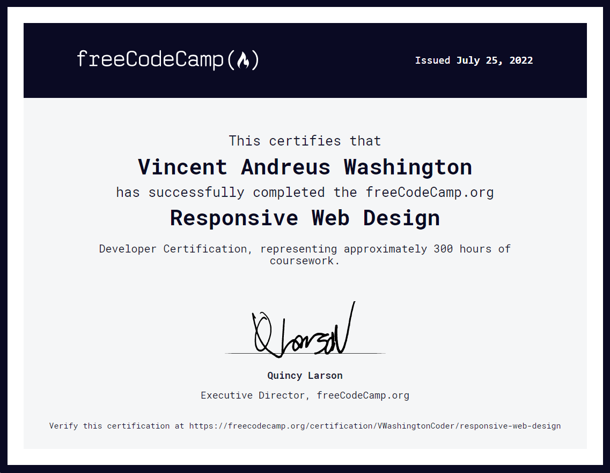
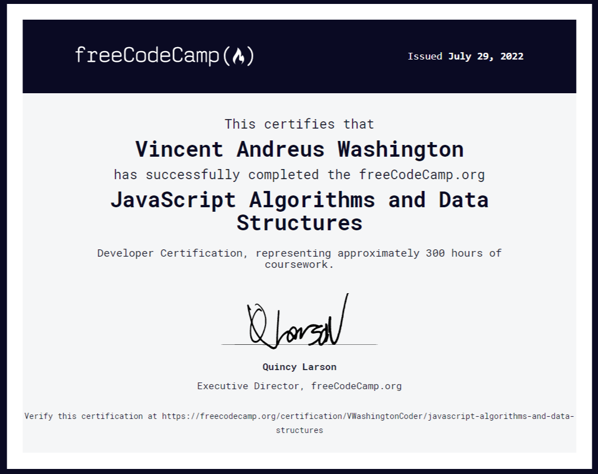

# FreeCodeCamp: Course Certifications & Tests

This is my collection of FreeCodeCamp certifications earned as well as the tests (projects) that aligns with each certificate.

## Certifications
* Responsive Web Design
    

* JavaScript Algorithms And Data Structures
    

## Certification Tests
### Responsive Web Design
* Build a Survey Form
    -  Objective: Build an app that is functionally similar to https://survey-form.freecodecamp.rocks

* Build a Tribute Page
    -  Objective: Build an app that is functionally similar to https://tribute-page.freecodecamp.rocks

* Build a Technical Documentation Page
    -  Objective: Build an app that is functionally similar to https://technical-documentation-page.freecodecamp.rocks

* Build a Product Landing Page
    -  Objective: Build an app that is functionally similar to https://product-landing-page.freecodecamp.rocks

* Build a Personal Portfolio Webpage
    -  Objective: Build an app that is functionally similar to https://personal-portfolio.freecodecamp.rocks

### JavaScript Algorithms and Data Structures
* Palindrome Checker
    - Objective: Return true if the given string is a palindrome. Otherwise, return false.
* Roman Numeral Converter
    - Objective: Convert the given number into a roman numeral.
* Caesars Cipher
    - Objective: Write a function which takes a ROT13 encoded string as input and returns a decoded string.
* Telephone Number Validator
    - Objective: Return true if the passed string looks like a valid US phone number.
* Cash Register
    - Objective: Design a cash register drawer function checkCashRegister() that accepts purchase price as the first argument (price), payment as the second argument (cash), and cash-in-drawer (cid) as the third argument.